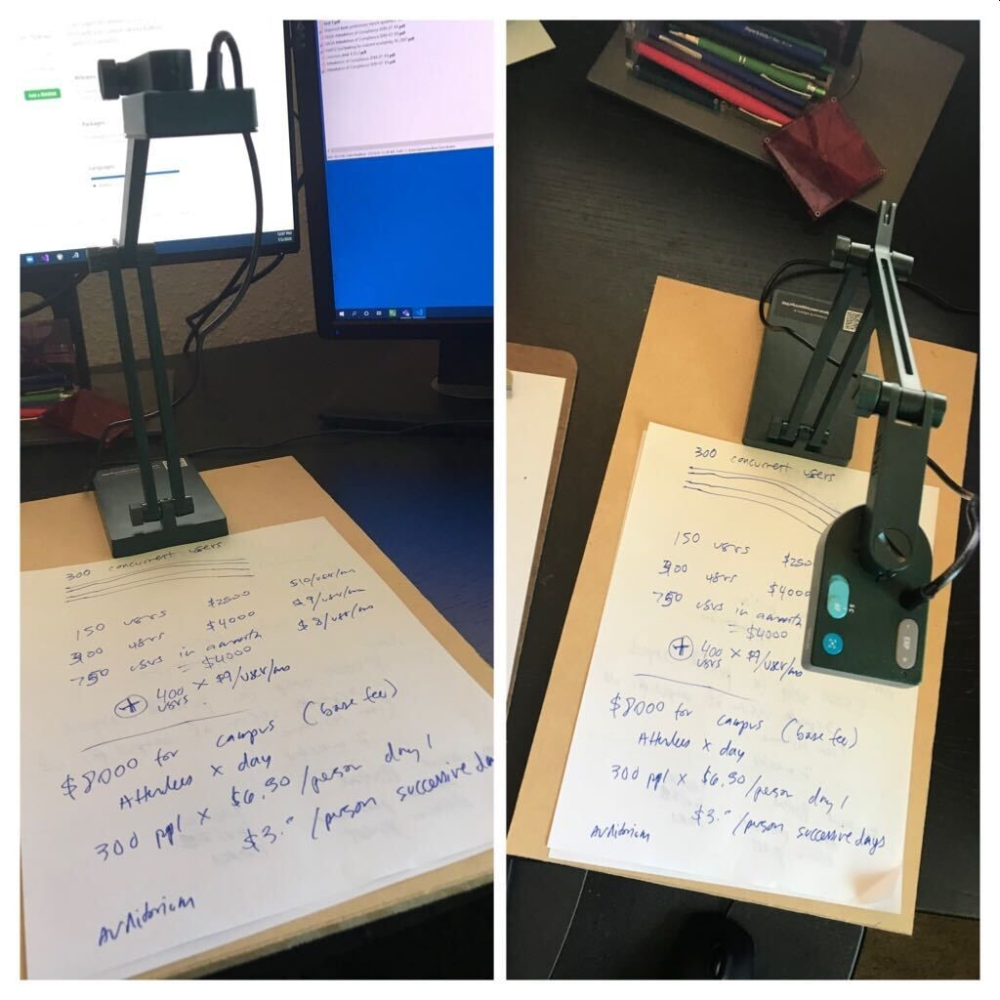

# Rapid document scanning tool

Rapidly turn your stack of hand-written notes into multi-page PDFs.

1. Press [SPACE] to scan each page
2. Press [ESC] to indicate the end the document
3. Type a filename
4. Get the full file path to the multi-page PDF copied to your clipboard

Uses [OpenCV](https://docs.opencv.org/master/d6/d00/tutorial_py_root.html) to interact with the document camera, [ScanTailor](https://scantailor.org/) for content detection, and Python to glue it all together.

